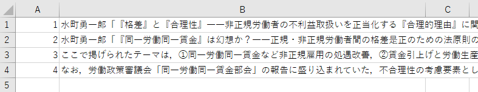
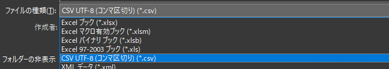

# README

`data` フォルダ内のMicrosoft Word文書（`.docx` ファイル）に半自動で脚注を一括設定する。

## 使い方

### 手順1 `data` に処理対象のファイルをコピーする

### 手順2 脚注の対応表CSVを作成する

1列目が注番号、2列目が注内容のCSVを作成し、 **`docx`ファイルと同じ名前で保存する**。

上図のようにMicrosoft Excelで作成した場合、保存時に `CSV UTF-8 (コンマ区切り)` を選択する。

### 手順3 `run.dat` をダブルクリックする

