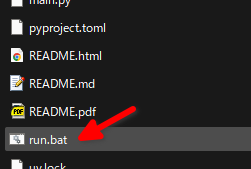
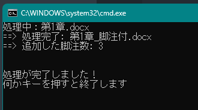
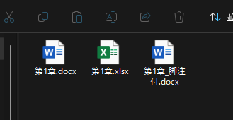

# README

`data` フォルダ内のMicrosoft Word文書（`.docx` ファイル）に半自動で脚注を一括設定する。

## 動作環境

プロジェクトマネージャー [uv](https://docs.astral.sh/uv/) を使用。
インストールコマンドは下記。

```bash
powershell -ExecutionPolicy ByPass -c "irm https://astral.sh/uv/install.ps1 | iex"
```


## 使い方

### 手順1 `data` に処理対象のファイルを配置する


このとき、脚注を入れたい箇所を `【【1】】` や `【【2】】` のように墨つきパーレンを二重にして指定する。


### 手順2 脚注の対応表 Excel を作成する

先頭シートの1列目が注番号、2列目が注内容の Excel を作成し、 **`docx`ファイルと同じ名前で保存する**。


### 手順3 開いている Word と Excel を閉じる

プログラムの実行時に Office アプリが開いていると固まることがあるため。


### 手順4 `run.bat` をダブルクリックする



黒い画面が開いて処理が始まり、問題なく終了した場合は `処理が完了しました！` と表示されるので何かキーを押すと画面が閉じて終了する。



最終的に、元の文書と同じフォルダに `_脚注付` という名前で新規作成される。





